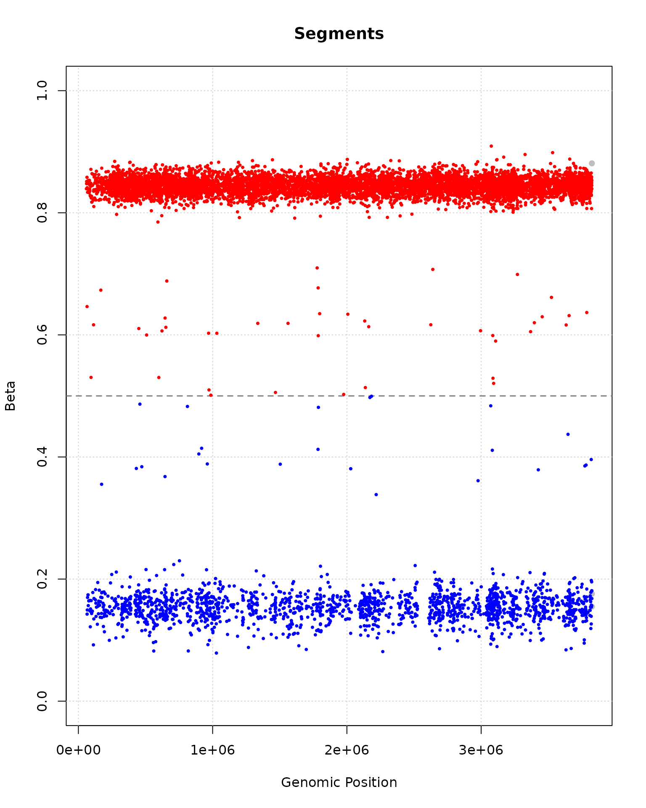
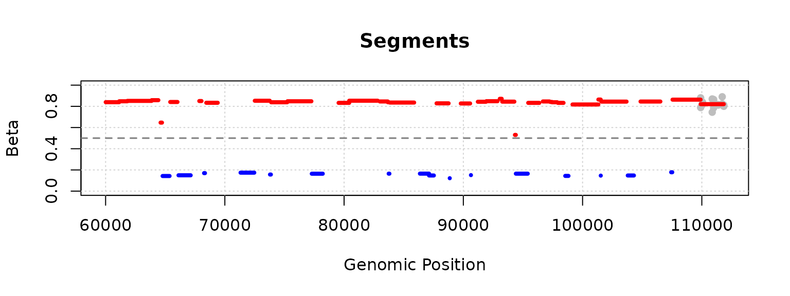

# Example workflow using FUSE

``` r
library(fuseR)
```

### Reading in data

We start by reading in the data, which consist of the tables K0 and K1.
Both have CpG sites as rows and samples as columns, and

- K0 contains the unmethylated counts
- K1 contains the methylated counts

This is a dummy data set consisting of manipulated counts of the 100 000
first CpG sites in chromosome 20.

``` r
k0_file <- system.file("examples/k0.tsv.gz", package = "fuseR")
k1_file <- system.file("examples/k1.tsv.gz", package = "fuseR")

K0 <- read.table(k0_file, header = TRUE)
K1 <- read.table(k1_file, header = TRUE)


head(K0)
```

    ##             Sample1 Sample2 Sample3 Sample4 Sample5 Sample6 Sample7 Sample8
    ## chr20.60008       0       6       0       0       0       0       0       0
    ## chr20.60009       0       0       9       0      17       0      17       0
    ## chr20.60119      21       0       0      22       0      21       0       3
    ## chr20.60120      17       0       0      21      16      19       0       0
    ## chr20.60578       0      16       0       8       5       0       0      19
    ## chr20.60579       0      13      17       0      10       0       0      11
    ##             Sample9 Sample10 Sample11 Sample12 Sample13 Sample14 Sample15
    ## chr20.60008       0       17       18        0        7        0        0
    ## chr20.60009      17        7        1       19        3       16        0
    ## chr20.60119       0       21        6        0        0       17       16
    ## chr20.60120       0        0       19        0        0        0       11
    ## chr20.60578       0        4        0        4       15        0        0
    ## chr20.60579       0        2       20        0        0       16        6
    ##             Sample16 Sample17 Sample18 Sample19 Sample20
    ## chr20.60008       17       13       17       21        0
    ## chr20.60009       16       10        0       16        0
    ## chr20.60119        3        2       15        9        0
    ## chr20.60120        0        0        5       18        0
    ## chr20.60578       19        0        0       22        0
    ## chr20.60579        0        2        0        0        9

### Apply FUSE as a pipeline

The whole FUSE pipeline can be applied using the function
‘fuse.segment()’. It performs the following steps:

1.  clustering
2.  cutting clustering tree optimally
3.  summarizing segments

The function takes as input the count matrices K0 and K1 and the
chromosome and position information for each CpG site, and outputs a
summary table and a data frame with betas.

``` r
segment_result <- fuse.segment(
  as.matrix(K0), 
  as.matrix(K1), 
  chr = sub("\\..*$", "", rownames(K0)), 
  pos = as.numeric(sub("^.*\\.", "", rownames(K0))))

head(segment_result$summary)
```

    ##       Segment   Chr Start   End CpGs Length      Beta Coherent
    ## 1 chr20.60008 chr20 60008 61140   17   1133 0.8378468    FALSE
    ## 2 chr20.61141 chr20 61141 61817   12    677 0.8450438    FALSE
    ## 3 chr20.61818 chr20 61818 63862   18   2045 0.8514536    FALSE
    ## 4 chr20.63863 chr20 63863 64424   13    562 0.8565943    FALSE
    ## 5 chr20.64609 chr20 64609 64728    6    120 0.6418476    FALSE
    ## 6 chr20.64778 chr20 64778 65365    6    588 0.1449167    FALSE

``` r
head(segment_result$betas_per_segment)
```

    ##               Sample1   Sample2   Sample3    Sample4   Sample5    Sample6
    ## chr20.60008 0.7331288 0.7795786 0.8133333 0.84156977 0.7853659 0.81250000
    ## chr20.61141 0.8740920 0.7928571 0.8174157 0.86084906 0.8803612 0.89154013
    ## chr20.61818 0.8943894 0.8278388 0.7691083 0.89508197 0.8259587 0.82819383
    ## chr20.63863 0.8560748 0.8793103 0.8287154 0.87633262 0.7705628 0.81779661
    ## chr20.64609 0.5810056 0.7909605 0.5865385 0.63636364 0.6150943 0.71794872
    ## chr20.64778 0.2077922 0.1000000 0.2321429 0.02764977 0.0000000 0.07692308
    ##               Sample7    Sample8   Sample9   Sample10  Sample11  Sample12
    ## chr20.60008 0.8653251 0.89727127 0.9042357 0.81441718 0.7964169 0.8934911
    ## chr20.61141 0.9152120 0.94017094 0.7426326 0.85650224 0.7752294 0.7946429
    ## chr20.61818 0.8787313 0.77701544 0.8374291 0.83053691 0.8900145 0.8762376
    ## chr20.63863 0.8160622 0.77941176 0.8909513 0.74315789 0.8958333 0.9621749
    ## chr20.64609 0.6912442 0.69565217 0.7898551 0.51933702 0.6346154 0.6311111
    ## chr20.64778 0.2844037 0.05769231 0.1984733 0.08024691 0.1188811 0.1530612
    ##              Sample13   Sample14  Sample15  Sample16  Sample17   Sample18
    ## chr20.60008 0.8477930 0.85780526 0.8138848 0.8699187 0.8298755 0.89660743
    ## chr20.61141 0.9192140 0.91549296 0.8333333 0.8463357 0.8592965 0.78795812
    ## chr20.61818 0.8681481 0.81139756 0.8013468 0.8629283 0.8820059 0.93140244
    ## chr20.63863 0.8687783 0.83193277 0.8916479 0.9232614 0.8540434 0.80167015
    ## chr20.64609 0.5294118 0.66666667 0.6567164 0.4928910 0.6908213 0.65024631
    ## chr20.64778 0.1682692 0.05462185 0.2631579 0.1298077 0.2117117 0.05952381
    ##              Sample19  Sample20
    ## chr20.60008 0.7971014 0.9366603
    ## chr20.61141 0.7953092 0.8556034
    ## chr20.61818 0.9240924 0.8153619
    ## chr20.63863 0.9120172 0.9628713
    ## chr20.64609 0.6808511 0.6701031
    ## chr20.64778 0.2166667 0.2110092

``` r
plot(segment_result, segments_to_plot = 1:nrow(segment_result$summary))
```



## Apply FUSE through separate steps

If the intermediate outputs of the method are relevant, then the
pipeline can also be applied by calling each of the functions
‘fuse.cluster()’, ‘number.of.clusters()’, ‘fuse.cut.tree()’, and
‘fuse.summary()’ separately.

### 1. Cluster

In the first step, ‘fuse.cluster()’ is applied on the count matrices.
This performs a hierarchical clustering of closest neighbors, and
outputs a clustering tree.

``` r
tree <- fuse.cluster(as.matrix(K0), as.matrix(K1))
head(tree)
```

    ##          m1     m2 logl_tot logl_merge genomic_dist
    ## [1,] -45579 -45580 10.65993   10.65993     1.144830
    ## [2,] -57737 -57738 12.62932   12.62932     1.144830
    ## [3,] -46190 -46191 12.70708   12.70708     1.176616
    ## [4,] -49658 -49659 12.57786   12.57786     1.877867
    ## [5,] -23937 -23938 16.63625   16.63625     1.144830
    ## [6,] -41560 -41561 17.26477   17.26477     1.146329

The clustering ‘tree’ contains the following columns:

- ‘m1’: the label of the first merged point
- ‘m2’: the label of the second merged point
- ‘logl_tot’: Change in total log-likelihood for forming this merge
- ‘logl_merge’: Total cost of the points in this formed cluster
- ‘genomic_dist’: Distance penalty for this merge

### 2. Cutting the tree

In order to cut the clustering tree, the optimal number of segments
needs to be calculated. For this we have the function
‘number.of.clusters()’, which performs model selection by minimizing
either the Bayesian Information Criterion (BIC, default), or the Akaike
Information Criterion (AIC).

``` r
# Need the total likelihood per model, which is sum of likelihood changes
tree[,3] <- cumsum(tree[,3])

optimal_num_of_segments <- number.of.clusters(tree, ncol(K0), 'BIC')
optimal_num_of_segments
```

    ## [1] 9030

The tree can then be cut using ‘fuse.cut.tree()’

``` r
segments <- fuse.cut.tree(tree, optimal_num_of_segments)
head(segments, 100)
```

    ##   [1] 1 1 1 1 1 1 1 1 1 1 1 1 1 1 1 1 1 2 2 2 2 2 2 2 2 2 2 2 2 3 3 3 3 3 3 3 3
    ##  [38] 3 3 3 3 3 3 3 3 3 3 4 4 4 4 4 4 4 4 4 4 4 4 4 5 5 5 5 5 5 6 6 6 6 6 6 7 7
    ##  [75] 7 7 7 7 7 7 7 7 7 7 8 8 8 8 8 8 8 8 8 8 8 8 8 8 9 9

### 3. Summarizing segments

The segments can be summarized in a table with the function
‘fuse.summary()’.

``` r
result <- fuse.summary(as.matrix(K0), 
                       as.matrix(K1), 
                       chr = sub("\\..*$", "", rownames(K0)), 
                       pos = as.numeric(sub("^.*\\.", "", rownames(K0))), 
                       segments)

head(result$summary)
```

    ##       Segment   Chr Start   End CpGs Length      Beta Coherent
    ## 1 chr20.60008 chr20 60008 61140   17   1133 0.8378468    FALSE
    ## 2 chr20.61141 chr20 61141 61817   12    677 0.8450438    FALSE
    ## 3 chr20.61818 chr20 61818 63862   18   2045 0.8514536    FALSE
    ## 4 chr20.63863 chr20 63863 64424   13    562 0.8565943    FALSE
    ## 5 chr20.64609 chr20 64609 64728    6    120 0.6418476    FALSE
    ## 6 chr20.64778 chr20 64778 65365    6    588 0.1449167    FALSE

``` r
head(result$betas_per_segment)
```

    ##               Sample1   Sample2   Sample3    Sample4   Sample5    Sample6
    ## chr20.60008 0.7331288 0.7795786 0.8133333 0.84156977 0.7853659 0.81250000
    ## chr20.61141 0.8740920 0.7928571 0.8174157 0.86084906 0.8803612 0.89154013
    ## chr20.61818 0.8943894 0.8278388 0.7691083 0.89508197 0.8259587 0.82819383
    ## chr20.63863 0.8560748 0.8793103 0.8287154 0.87633262 0.7705628 0.81779661
    ## chr20.64609 0.5810056 0.7909605 0.5865385 0.63636364 0.6150943 0.71794872
    ## chr20.64778 0.2077922 0.1000000 0.2321429 0.02764977 0.0000000 0.07692308
    ##               Sample7    Sample8   Sample9   Sample10  Sample11  Sample12
    ## chr20.60008 0.8653251 0.89727127 0.9042357 0.81441718 0.7964169 0.8934911
    ## chr20.61141 0.9152120 0.94017094 0.7426326 0.85650224 0.7752294 0.7946429
    ## chr20.61818 0.8787313 0.77701544 0.8374291 0.83053691 0.8900145 0.8762376
    ## chr20.63863 0.8160622 0.77941176 0.8909513 0.74315789 0.8958333 0.9621749
    ## chr20.64609 0.6912442 0.69565217 0.7898551 0.51933702 0.6346154 0.6311111
    ## chr20.64778 0.2844037 0.05769231 0.1984733 0.08024691 0.1188811 0.1530612
    ##              Sample13   Sample14  Sample15  Sample16  Sample17   Sample18
    ## chr20.60008 0.8477930 0.85780526 0.8138848 0.8699187 0.8298755 0.89660743
    ## chr20.61141 0.9192140 0.91549296 0.8333333 0.8463357 0.8592965 0.78795812
    ## chr20.61818 0.8681481 0.81139756 0.8013468 0.8629283 0.8820059 0.93140244
    ## chr20.63863 0.8687783 0.83193277 0.8916479 0.9232614 0.8540434 0.80167015
    ## chr20.64609 0.5294118 0.66666667 0.6567164 0.4928910 0.6908213 0.65024631
    ## chr20.64778 0.1682692 0.05462185 0.2631579 0.1298077 0.2117117 0.05952381
    ##              Sample19  Sample20
    ## chr20.60008 0.7971014 0.9366603
    ## chr20.61141 0.7953092 0.8556034
    ## chr20.61818 0.9240924 0.8153619
    ## chr20.63863 0.9120172 0.9628713
    ## chr20.64609 0.6808511 0.6701031
    ## chr20.64778 0.2166667 0.2110092

### Verification

The outputs are identical.

``` r
identical(segment_result$summary, result$summary)
```

    ## [1] TRUE

``` r
identical(segment_result$betas_per_segment, result$betas_per_segment)
```

    ## [1] TRUE

## Plotting

Let’s visualize a small piece of the result:

``` r
plot(result, segments_to_plot = 1:50)
```


