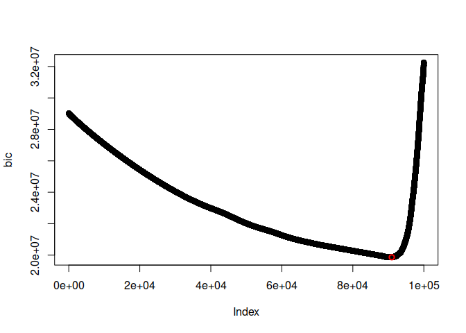
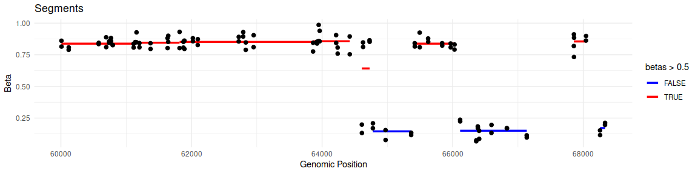

Example workflow using FUSE
================
Susanna Holmstrom
2025-05-12

``` r
library(fuseR)
```

### Reading in data

We start by reading in the data, which consist of the tables K0 and K1.
Both have CpG loci as rows and samples as columns, and

- K0 contains the unmethylated counts
- K1 contains the methylated counts

This is a dummy data set consisting of the 100 000 first CpG sites in
chromosome 20.

``` r
k0 <- read.table(gzfile('k0.tsv.gz'), header = T, row.names = 1)
k1 <- read.table(gzfile('k1.tsv.gz'), header = T, row.names = 1)

head(k0)
```

    ##             Sample1 Sample2 Sample3 Sample4 Sample5 Sample6 Sample7 Sample8
    ## chr20.60008       0       6       0       0       0       0       0       0
    ## chr20.60009       0       0       9       0      17       0      17       0
    ## chr20.60119      21       0       0      22       0      21       0       3
    ## chr20.60120      17       0       0      21      16      19       0       0
    ## chr20.60578       0      16       0       8       5       0       0      19
    ## chr20.60579       0      13      17       0      10       0       0      11
    ##             Sample9 Sample10 Sample11 Sample12 Sample13 Sample14 Sample15
    ## chr20.60008       0       17       18        0        7        0        0
    ## chr20.60009      17        7        1       19        3       16        0
    ## chr20.60119       0       21        6        0        0       17       16
    ## chr20.60120       0        0       19        0        0        0       11
    ## chr20.60578       0        4        0        4       15        0        0
    ## chr20.60579       0        2       20        0        0       16        6
    ##             Sample16 Sample17 Sample18 Sample19 Sample20
    ## chr20.60008       17       13       17       21        0
    ## chr20.60009       16       10        0       16        0
    ## chr20.60119        3        2       15        9        0
    ## chr20.60120        0        0        5       18        0
    ## chr20.60578       19        0        0       22        0
    ## chr20.60579        0        2        0        0        9

### Cluster

Next, ‘fuse.cluster()’ is applied on the count matrices. This performs a
hierarchical clustering of closest neighbors, and outputs a clustering
tree.

``` r
tree <- fuse.cluster(as.matrix(k0), as.matrix(k1))
head(tree)
```

    ##          m1     m2 logl_tot logl_merge genomic_dist
    ## [1,] -45579 -45580 10.65993   10.65993     1.144830
    ## [2,] -57737 -57738 12.62932   12.62932     1.144830
    ## [3,] -46190 -46191 12.70708   12.70708     1.176616
    ## [4,] -49658 -49659 12.57786   12.57786     1.877867
    ## [5,] -23937 -23938 16.63625   16.63625     1.144830
    ## [6,] -41560 -41561 17.26477   17.26477     1.146329

The clustering ‘tree’ contains the following columns:

- ‘m1’: the label of the first merged point
- ‘m2’: the label of the second merged point
- ‘logl_tot’: Change in total log-likelihood for forming this merge
- ‘logl_merge’: Total cost of the points in this formed cluster
- ‘genomic_dist’: Distance penalty for this merge

### Number of segments

In order to cut the clustering tree, the optimal number of segments
needs to be calculated. Here it is demonstrated using Bayesian
Information Criterion (BIC)

``` r
# To compute BIC, we need the total likelihood of each model. This is the cumulative sum of changes in likelihood.
tree[,3] <- cumsum(tree[,3])

# BIC
bic <- numeric(nrow(tree)) # Initializing empty vector

# Finding number of samples (n), sites (m), and clusters (k). At first, number of clusters is number of sites, in the end all are in one cluster. 
m <- nrow(k0)
n <- ncol(k0)
k <- c(nrow(tree):1)

# Computing BIC for each model (number of clusters)
for( i in 1:nrow(tree)) {
  bic[i] <- n*log(m*n)*k[i] + 2*tree[i, 3]
}
```

We want to chose the model (number of clusters) that minimizes BIC.
Let’s see what the BIC curve looks like:

<!-- -->

The red dot in the plot visualizes the model where BIC is minimized.

``` r
# Recall that the number of clusters are indexed reversely (k)
optimal_num_of_segments <- length(bic) - (which.min(bic)-1)
optimal_num_of_segments
```

    ## [1] 9030

### Cutting the tree

The final step in the workflow is cutting the tree using ‘fuse.cutree()’

``` r
segments <- fuse.cutree(tree, optimal_num_of_segments)
```

### Extra: computing beta-values for the segments and plotting

``` r
# Preparing normal beta-values for plotting
betas <- data.frame(pos = as.numeric(sub("^chr20.", "", rownames(k0))), 
                    beta = rowSums(k1) / (rowSums(k0 + k1)))
head(betas)
```

    ##               pos      beta
    ## chr20.60008 60008 0.8607443
    ## chr20.60009 60009 0.8145363
    ## chr20.60119 60119 0.7891892
    ## chr20.60120 60120 0.8082192
    ## chr20.60578 60578 0.8343195
    ## chr20.60579 60579 0.8441176

``` r
# Computing beta values of segments
k0_c <- rowsum(k0, group = segments, na.rm = T)
k1_c <- rowsum(k1, group = segments, na.rm = T)

k0_c <- rowSums(k0_c, na.rm = T)
k1_c <- rowSums(k1_c, na.rm = T)

betas_segment <- k1_c / (k0_c + k1_c)
```

``` r
# Extracting start and end points of segments
location <- cbind(aggregate(betas$pos, by = list(segments), FUN = min), aggregate(betas$pos, by = list(segments), FUN = max)[,2])
names(location) <- c("Segment", "Start", "End")
location$betas <- betas_segment
head(location)
```

    ##   Segment Start   End     betas
    ## 1       1 60008 61140 0.8378468
    ## 2       2 61141 61817 0.8450438
    ## 3       3 61818 63862 0.8514536
    ## 4       4 63863 64424 0.8565943
    ## 5       5 64609 64728 0.6418476
    ## 6       6 64778 65365 0.1449167

Let’s visualize a small piece of the result:
<!-- -->
